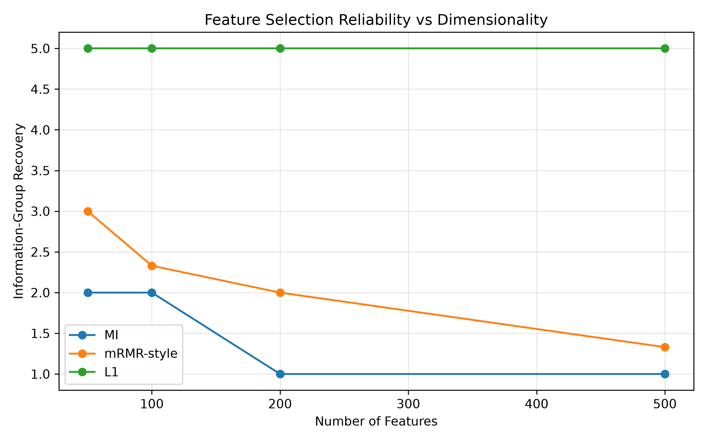
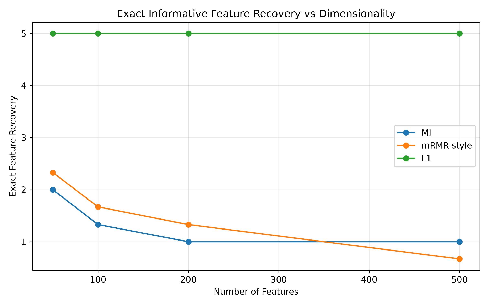
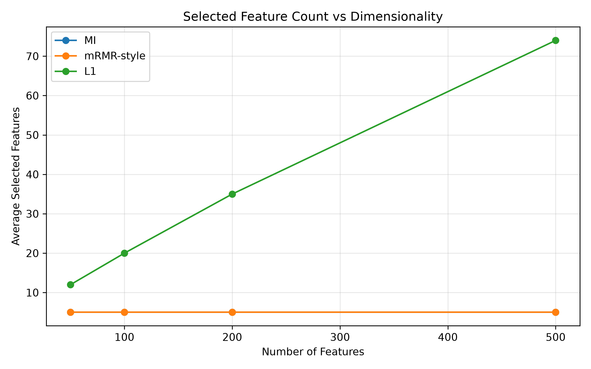
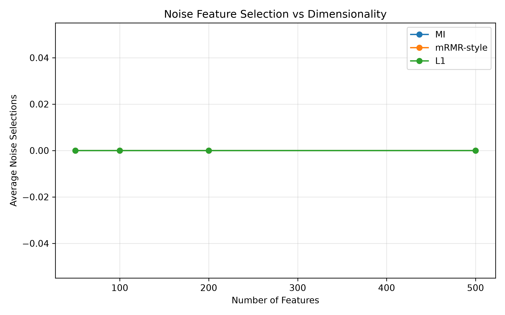

# Reliable Feature Selection in High-Dimensional Data

## Research Question

How reliably can feature-selection methods recover truly informative features as dimensionality, noise, and feature redundancy increase?

## Motivation

Feature selection is important when datasets contain many variables, especially when some features are redundant or irrelevant.

A feature-selection method should ideally:

* recover informative features,
* avoid selecting irrelevant noise,
* handle redundant features,
* remain reliable as dimensionality increases.

This project investigates these properties using controlled synthetic experiments.

## Methods

Three feature-selection approaches are compared:

### 1. Mutual Information (MI)

Mutual Information measures the statistical dependence between an individual feature and the target.

It provides a relevance-based baseline but does not explicitly penalize redundancy between selected features.

### 2. mRMR-style Selection

The mRMR-style method combines:

* Mutual Information for feature relevance
* Pearson correlation for redundancy

The selection score is:

`relevance - 0.1 × redundancy`

This implementation is described as mRMR-style because it is not a complete canonical implementation of the standard mRMR algorithm.

### 3. L1 Regularization

L1-regularized logistic regression encourages sparse model coefficients.

Features with sufficiently large learned coefficients are retained.

## Experimental Design

Synthetic datasets were generated with:

* 5 truly informative features
* redundant copies of informative features
* randomly generated noise features

The total number of features was varied:

| Total Features |
| -------------: |
|             50 |
|            100 |
|            200 |
|            500 |

Each experiment was repeated using three random seeds.

## Evaluation Metrics

### Exact Feature Recovery

Number of the five original informative features selected.

### Information-Group Recovery

Number of underlying informative groups recovered.

An information group contains an original informative feature and its redundant copies.

This metric is useful because selecting a redundant copy can still represent successful recovery of the underlying information.

### Noise Selections

Number of randomly generated noise features selected by each method.

### Selected Feature Count

Number of features retained by each method.

## Results

### Information-Group Recovery

L1 regularization maintained complete recovery of all five information groups across all tested dimensionalities.

MI and mRMR-style selection showed lower recovery as dimensionality increased in these experiments.



### Exact Feature Recovery

L1 maintained recovery of all five original informative features in the controlled experiments.



### Selected Feature Count

L1 selected increasingly larger subsets as dimensionality increased.



### Noise Selection

No noise features were selected by any of the three methods in the final comparison.



## Main Findings

The experiments show that:

1. MI showed decreasing feature-group recovery as dimensionality increased.
2. The mRMR-style method generally recovered more information groups than MI.
3. L1 regularization maintained complete information-group recovery in the tested synthetic settings.
4. L1 selected increasingly larger subsets as dimensionality increased.
5. No method selected noise features in the final comparison.

The results suggest that feature-selection reliability depends not only on feature relevance but also on redundancy and dimensionality.

## Limitations

These experiments use controlled synthetic datasets, so the results cannot be assumed to generalize directly to real-world datasets.

Only three random seeds were used for each dimensionality.

The Mutual Information estimator is a simple histogram-based estimator.

The mRMR implementation is an mRMR-style approach rather than a complete canonical implementation.

## Future Work

Possible extensions include:

* increasing the number of experimental repetitions,
* evaluating real-world datasets,
* testing additional feature-selection methods,
* studying the effect of regularization strength,
* investigating feature-selection stability,
* comparing predictive performance after feature selection.

## Project Structure

```text
reliable-feature-selection/
│
├── .venv/                         # Local Python environment (not committed)
│
├── data/
│   └── test_dataset.csv
│
├── src/
│   ├── generate_data.py
│   ├── check_data.py
│   ├── baseline.py
│   ├── mutual_information.py
│   ├── mi_experiment.py
│   ├── mrmr.py
│   ├── mrmr_experiment.py
│   ├── stability_experiment.py
│   ├── high_dimensional_experiment.py
│   ├── l1_experiment.py
│   ├── l1_regularization_experiment.py
│   ├── l1_final_experiment.py
│   ├── final_comparison.py
│   └── plot_results.py
│
├── results/
│   ├── figures/
│   │   ├── group_recovery_vs_dimensions.png
│   │   ├── exact_recovery_vs_dimensions.png
│   │   ├── selected_features_vs_dimensions.png
│   │   └── noise_selections_vs_dimensions.png
│   │
│   └── tables/
│       └── final_comparison.csv
│
├── report/
│   └── results_and_discussion.md
│
├── .gitignore
└── README.md
```

## Reproducibility

The experiments were implemented using Python, NumPy, pandas, and Matplotlib.

The final method comparison can be reproduced with:

```bash
python src/final_comparison.py
```

The figures can be generated with:

```bash
python src/plot_results.py
```

## Author

**Rasmy R K**

B.Tech Artificial Intelligence and Machine Learning
St. Joseph's College of Engineering, Chennai
